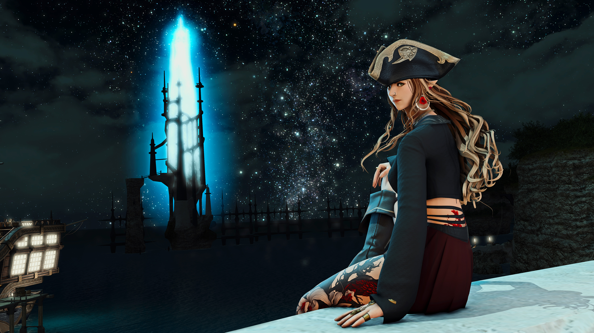

# suicide-note

People like to say things like, "it'll get better", or "there's always hope things will improve". But the unfortunate reality is, that for a lot of people out there: no, that just isn't true.

I'm a woman that is transgender. Since I started transitioning 3 years ago, the world has demonstrated that it does not accept transgender people are valid or deserve to live.

Instead of investing in helping us, or fostering a compassionate culture of understanding and acceptance, governments are now outright removing our basic human rights, and removing access to life-saving healthcare that allows us to live genuine, happy lives.

This is trickling down into popular culture, too. Transphobia is becoming systemic in “women’s rights” and "parents' rights" groups, with them dismissing gender dysphoria as "insanity" under the disguise of “keeping people safe”, which no-one seems to want to challenge.

Lesbian, Gay and Bisexual communities too, are starting to distance themselves from transgender people. The "T" in LGBT+. The very community by whom I was supposed to be unquestionably accepted.

The future is being set up to ensure that the lives of transgender people are made horrific enough so as to encourage suicide, so that we’re no longer a problem.
But no-one seems to care. In fact, people are purposely *voting* for this. It's terrifying.

And so ultimately, despite the euphoria of what was supposed to be a positive journey of self-realisation of who and what I was, finally feeling ‘right’ in myself, and taking decisive actions to live authentically in my actual gender, in return, the world simply rejected me. My life quickly devolved into loss, isolation, loneliness, spiralling expenses, and fear for my future.

I was told to wait 7 years for initial access to the life-saving healthcare that would only *start* improve my sense of wellbeing. And even then, after being ‘fixed’, I would emerge the other side, still subjected to the same amount of discrimination from wider society.

So, I was forced to pay privately to have access gender-affirming HRT, unsupported by my GP in doing so, because “they don’t have the expertise” - despite cisgender women being able to walk out of an appointment the same day with an Oestrogen patch prescription. Nor were they willing to work with one of the only few accessible private HRT prescribers, who additionally, were demonised by the GMC through prejudice.

After a few years of perserverance, I came to love the physicality given to me by transition - my female features through hormone therapy, growing out my newfound wavy hair (which I loved), finally actually taking care of my body... and for the first time in my life, I began to feel like what I physically saw in the mirror mapped up to what I was inside. It was euphoric, the most wonderful feeling. I began to truly love myself.

But then came the fear of having it all suddenly taken from me by transphobic legislation. The sword above my livelihood loomed lower and lower. It dropped sharply with puberty blockers being banned for trans children, ripping from them the possibility of even having decent lives from a young age, under the deceptive excuse of "safety". And now that the precedent has been set, the rights of trans adults is undoubtedly next.

As such, I felt increasingly unsafe in a world that was only becoming more and more hostile towards transgender people. The possibility of being forced, by law, to detransition, was horrifying. The idea of having to watch my face, my body, morph back into a physically repulsive shape, a gender that was not my own, slowly, month by month, day by day... would have been enough to push me to kill myself eventually anyway.

I would never have a family. My genetic parents rejected me when I came out. My mother refused to allow me into her home, frightened that "people would see". My father blasted me with transphobic words that called me invalid, dismissing my physical dysphoria and desire to transition as some sort of sexual fetish. My brother ridiculed me under the guise of wanting to ‘reconnect’. My sister, a cisgender lesbian, excused my father's words as "something I should expect". I can only imagine how much she and her wife laughed at me from afar.

Christmasses and birthdays became days to forget, desperately jealous of "normal" people who get to share those holidays with loved ones who care about them.

I would have never been able to find love. Lesbian and sapphic groups (I found other women attractive, unfortunately) are openly exclusionary to women who are transgender. They mock people like myself, refusing to consider us as anything other than male because of the bodies we are born with. I encountered several transphobic discord groups hiding in plain sight on Reddit. I stopped trying to date or even find sapphic friends as a result, knowing I would likely be considered a freak and kicked back out.

I would have died single.

I would never have been able to form close friendships, as I could never trust that people don't just see me as disgusting or insane, hiding their transphobic beliefs. Seeing me as a "woman, but not really".

My best friend’s parents, people whom I once felt like I could trust, started seeing me as too shameful to invite to social gatherings with their other friends, for fear of being judged.

All of this was on top of the crippling dysphoria I endured every single day. I hated my voice. I hated my height. I hated my masculine hands. I hated my body. 

And so: I have had enough of this lonely, miserable, fearful existence. This lesser life, where I'd never be cisgender, I'd always have to take hormones, have surgeries, and still never be considered truly 'female' by anyone other than particularly sympathetic people.

#### To the only few loved ones in my life
- To Sarah, an unexpected friend, thank you for accepting me and making me feel like I was normal and worth knowing. You were the mother I never had. I wish you and your children the boundless happiness you all deserve.
- To my cat, Millie, I loved you more than words can describe, my little warrior, my princess, my crazy girl, my pretty little companion, my friend. I envied your peaceful existence ever so much. I know Lisa will take good care of you.
- To Lisa, my best friend, my sister, your friendship was the best thing to ever happen to me. You are a soul that this world does not deserve, full of love, kindness and genuine empathy. I would not have even survived to this point, were it not for your endless support, catching me whenever I was falling into despair.
- To my online friends, I appreciated your friendship, even if it was from afar.
- And to Captain Stephanie Vermilliaux... my beloved alter-ego. You were everything I wanted to be. You were strong. Independent. You were *painfully* beautiful. Resilient. Inspiring. Charismatic and free. Getting to live vicariously through you was bittersweet. You were hope.
May the Blood Roses ever sail the endless blue; the holds of the Scarlet Rose filled with gold immeasurable.

#### To my work

I’m sorry I was so unreliable towards the end. I was genuinely honoured to work for such a positive organisation. Thank you for accepting me so readily and unquestionably.
I hope my death shines a light on the worsening oppression transgender people are facing, and how it affects the lives of your trans employees.

#### To the world at large

Understand that transgender people don’t *want* to be transgender. We have not chosen this life. It’s an incongruence that we did not ask for, it tortures us inside daily, and we can’t do anything about it other than transition to attempt to live meaningful lives.

All the world needs to do, is accept the fact that we exist.
We always will, and always have done.

So help us. Stop trying to kill us. Give us the care we need, and accept us. We *want* to live happily, just like you.

We are your sisters, your brothers, your siblings.

---

If you’ve read all of this, I’m already gone. I'm now sleeping peacefully forever. No longer a burden, a problem for society, a voice to be silenced.

There was no place for me in the world.

Life was not worth living.

Sea swallowed all.

🏴‍☠️ x

---

